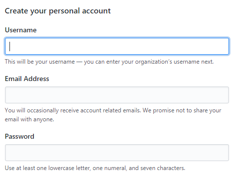
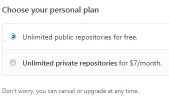

# GitHub Tutorial

_by Shi Wei Zheng_

---
## Git vs. GitHub  
Git is the place where we code and keep the snapshot of the code that we did. Github is the cloud where all the codes are stored. In GitHub, we can see the changes that we made after we committed and pushed the code into GitHub. All the changes can be seen by others and people can give suggestions to the code to make it better. Git is able to run by itself, while GitHub requires git to run.


---
## Initial Setup

#### Creating A GitHub Account
1. Go to [GitHub](https://github.com/)
2. Click on the _Sign Up_ on the top right of the site 
3. Input your _Username_, _Email Address_, and _Password_ 
4. Click on _Create an Account_  
5. Choose a plan that you desire 
6. Click _Continue_ 
7. Either fill out the tailor experience  or click _skip this step_ 
8. You created a GitHub account

#### Using SSH Key
SSH key allows the user to connect the local remote or cloud9 to GitHub. The key allows GitHub to identify you, just like when you have to input your username and password to log in. GitHub remembers the key so it will know you are the one making the changes.

1. Go to [GitHub](https://github.com/)
2. Select _Settings_ on the top right (your profile icon)
3. Select _SSH and GPG keys_ on the sidebar located on the left
4. Click on _New SSH key_
5. Add a title
6. On a new tab, go to [cloud9](https://c9.io/)
7. Sign in to cloud9
8. Click on _Account Settings_ (the gear icon on the top right)
9. Select _SSH Keys_ on the sidebar located on the left
10. Copy the **second** SSH key
11. Go back to the GitHub tab
12. Paste the SSH Key in the _Key_ section
13. Click _Add SSH key_
14. Go to your **IDE** (Integrated Development Environment)in cloud9
15. Type `ssh -T git@github.com` (This make your terminal know that it is connected to GitHub) in your **terminal**
16. It should say something like "Hi <your username>! You've successfully authenticated, but GitHub does not provide shell access._"
17. You finish connecting cloud9 to your private git repository!


---
## Repository Setup
A repository is a place where you store codes. You can take the code and bring the code down to your local remote or computer.

1. Go to your **terminal**
2. Make sure you are in **workspace**, if not, `cd ~/workspace` (This will bring you to workspace)
3. Make a new directory/folder using `mkdir` and give the folder a name
4. Move into the folder with `cd` and the folder name
5. Use `git init` to initialize the folder to make it able to work as git.
6. Create a new file with `touch README.md` (This will create a file called README.md)
7. Use `c9 README.md` to open the README file in your _cloud9 terminal_
8. Add some texts in the file
9. Save your changes
10. In the terminal, use`git add .` to add all the new changes in the staging area
11. `git status` to check what changes have been staged and what haven't
12. Commit/snapshot the new changes using `git commit -m "your message"` (when committing, you need to add a message to tell you and/or others what that commit does. The message have to be in the present tense. Example: "Create a readme file")
13. We will need a remote repo to push the commit into
14. Go to [GitHub](https://github.com/) and login if not already
15. Click on the _plus icon_ on the top right and select _New repository_
16. Type in the **exact same name for your directory/folder** as the _Repository name_
17. Click _Create repository_ on the bottom
18. Verify your email if asked
19. In quick setup, make sure SSH is selected
20. Copy and paste each line of code under "...or push an existing repository from the command line" one at a time into your _c9 terminal_. This first line should be `git remote add origin URL` (The URL is the link to the repository that you just made). This line of code will create a bridge/path connecting your local repository to your remote repository. The second line should be `git push -u origin master`. This will tell the computer to _remember_ where to push to, so we don't have to keep including the URL everytime we push. We just have to put this line of code once and next time we can just type `git push`.
* To check the location of your remote use `git remote -v`
* To remove your remote use `git remote rm origin`
21. You finished setting up your own repository!


---
## Workflow & Commands
When making changes to your work, you should try to send those changes to GitHub once you think it is a good place to commit. This will save your work virtually in GitHub and you can check what changes were made to the work. You will not lose your work when it is saved in GitHub. You can always get your work back even if your computer stopped, and have to get a new one. To save your work to GitHub, follow these steps:
1. After you think your work is ready to be saved, use `git status` to check that your file had been modified. This will be shown in red when you having added the modified file to the staging area. (You will use this command a lot to check what you did or your current status on your work.)
2. Type `git add .` to add all your changes to the staging area.
3. Use `git status` to check that your modified file is in the staging area. This time the word will change to the color green.
4. Commit/snapshot the new changes using `git commit -m "your message"` (when committing, you need to add a message to tell you and/or others what that commit does. The message have to be in the present tense. Example: "Create a readme file")
5. Use `git status` to check that you have committed your changes
6. Now push your commit(s) with `git push`. When setting up your repository you already told the computer to _remember_ where to push your commits to, so you do not have to tell it where you want your commits to be push to.
7. **Repeat** these steps when trying to push to GitHub again


---
## Rolling Back Changes
There will be times when you made some mistake and want to undo those changes. You can't use command(mac)/control(windows) z. You will need to type in some commands in your terminal.

#### Undoing edit
You will use this when you work with someone on the same repository and you accidentally change something in the file. This may cause a problem when they merge the changes together.
1. Use `git status` to check your current status
2. Look for something like
```HTML
On branch master
Your branch is up-to-date with 'origin/master'.

Changes not staged for commit:
  (use "git add <file>..." to update what will be committed)
  (use "git checkout -- <file>..." to discard changes in working directory)
```
3. You will use the code that says "to discard changes in working directory". This will undo your edit. Do not include `...` and `<>` symbol.
4. Change the word "file" to the name of your file
5. The edits you made in your file will be undo


#### Undoing `add`
You will use this when you accidentally added multiple files when you only want to add a specific file.
1. You added your file to the staging area and realize you don't want to add it
2. Use `git status` to see if the file is added to the staging area. It is added when the file is green
3. You should see something like 
```HTML
On branch master
Your branch is up-to-date with 'origin/master'.

Changes to be committed:
  (use "git reset HEAD <file>..." to unstage)
```
4. Use the code that says "to unstage" to undo added files. Do not include `...` and `<>` symbol.
5. Change the word "file" to the name of your file
6. Use `git status` again and you will see that the file is red
7. You undo your added file(s)


#### Undoing `commit`
You will use this if you want to change your commit message. There are different codes to undo a commit, and each code has its own effect.
* `HEAD~1` means to move the HEAD 1 commit back
* `git reset --soft HEAD~1`
  * Your commit will be undone, and your file and the staging area not be changed. The file will still be in the staging area.


#### Undoing `commit` And `add`
This is used when you want to add or change something in the commit.
* `git reset HEAD~1`
  * Your commit will be undone, and your changes will still be present. You will be able to continue the changes you made. The file in the staging area will be deleted


#### Undoing `commit` and `add` And edits
This is used to delete the whole changes along with the commit and the file in the staging area.
* `git reset --hard HEAD~1`
  * This will nuke/delete the current commit
  * Since `--hard` was used, your file will change to the state of the previous commit. Your changes are deleted


#### `Checkout` from a destroyed `commit`
This allows you to temporarily go back to a destroyed commit.
* Use this when you want to recover a commit that you destroyed
  * `git log`
  * This code will show a list of commit shas
  * Use `git checkout -b someNewBranchName shaYouDestroyed` when you found the sha for the commit that you destroyed. Replace `someNewBranchName` with a new name and `shaYouDestroyed` with the sha that you destroyed. This will bring you back to the commit that you destroyed and make another commit at the same time.
  * You can also use `git checkout -b shaYouDestroyed` to just bring you back to the destroyed commit and not making another commit.


#### `Revert` to a previous `commit`
This will help you go back to a previous `commit` without changing the history of your work.
* Use `git revert sha` to revert the commit represented by the sha
* `git revert HEAD~2..HEAD` will revert the last 2 commits (This is a range from different places)
* `git revert sha1..sha4` is also a range but using the commit sha
* `git revert -m 1 merge_commit_sha` this will revert to the commit that was merged. Change "merge_commit_sha" to commit sha that was merged.


#### Undoing `push`
You use this when you want to undo a commit that's in the remote repository.
1. Use `git log` to show all your commit sha
2. The commit area order from the most recent (top of the list), to first commit (bottom of the list)
3. Find the sha for the commit that you want to unpush
4. Type `git revert sha` replace sha with the sha that you want to unpush. You can unpush multiple commits by including their sha next to each other separated by a space.
* To delete a commit from the remote, use `git reset --hard sha` (replace sha with the commit's sha that you want to remove). Then use `git push origin +master` to delete the commit


---
## Error Handling
* You used `git init` in the wrong directory
  * You may initialize the workspace and did not mean to do that.
  * Use `rm rf .git` to recursively force `.git` to be remove 
* 


## Collaboration
1. Go to [GitHub](https://github.com/)
2. _Login_ to your account
3. Go to other person's repository
4. Click on *fork* on the top right. The number next to it shows how many times the repository had beem forked. (You are making a copy of their repository and bring it to your own account)
5. Clone the repositoryto your local repository by clicking the green button that says "Clone or download"
6. Copy the link. Make sure it says "Clone with SSH" as the header of the box. If not, click "use SSH" on the top right of the box.
7. Go to your terminal and type `git clone URL`. Change the URL to the link you just copied.
8. A new folder should appear and you can make changes in it.
9. When you want to push the changes to the remote repository, the other person that you forked from will not recieve the changes. You will have to make a pull request when you what that person to see the changes you made and decide whether or not they want the changes. You will need to push the changes to your own repository first.
10. To make a pull request, go to your repository in GitHub
11. Click on "New pull request", right unnder the number of commits
12. Click "Create new pull requestion"
13. Click "Create new pull requestion" again
14. If you recieve a request you will click on "Pull requests" on the top
15. You will see a list of request. You can either accept or unaccept the request(s)
16. If you accept the request, you will need to bring the changes down to your local repository. Use `git pull` in your local repository to bring down your accepted changes.
17. You successful collaborated with others on the same work.